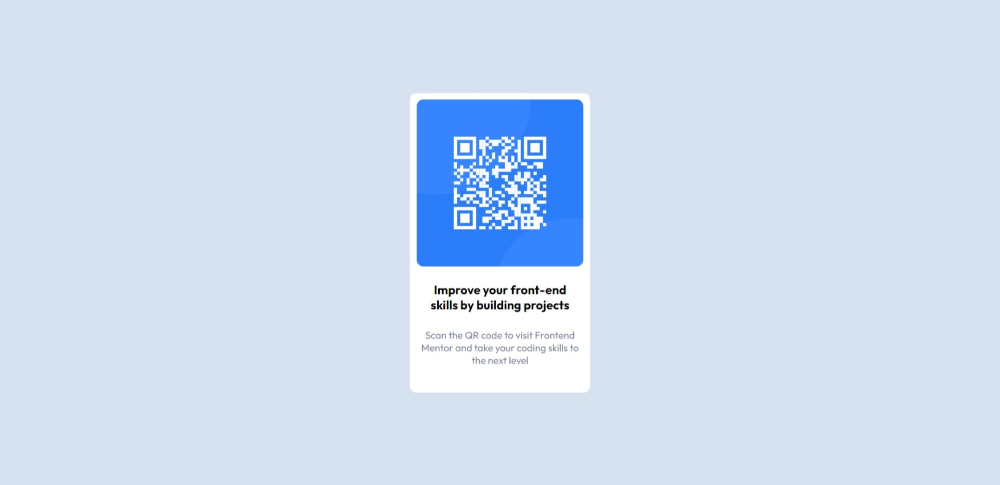

# Frontend Mentor - QR code component solution

This is a solution to the [QR code component challenge on Frontend Mentor](https://www.frontendmentor.io/challenges/qr-code-component-iux_sIO_H). Frontend Mentor challenges help you improve your coding skills by building realistic projects. 

## Table of contents

- [Overview](#overview)
  - [Screenshot](#screenshot)
- [My process](#my-process)
  - [Built with](#built-with)
  - [What I learned](#what-i-learned)
  - [Continued development](#continued-development)
- [Author](#author)


## Overview

### Screenshot





### Links


[Solution](qr_code_component.html)
## My process

### Built with

- Semantic HTML5 markup
- CSS custom properties


### What I learned

I learnt how to use media query in my code.


```css
@media (max-width: 500px) {
  #cardbox{
    width: 80vw;
    height: fit-content;
    padding: 20px;
  }
}
```

### Continued development

I want to focus on how to apply media query in my code and master it.


## Author

- Frontend Mentor - [@chiwykes](https://www.frontendmentor.io/profile/chiwykes)


